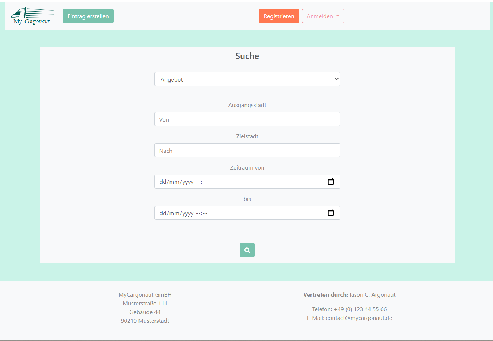
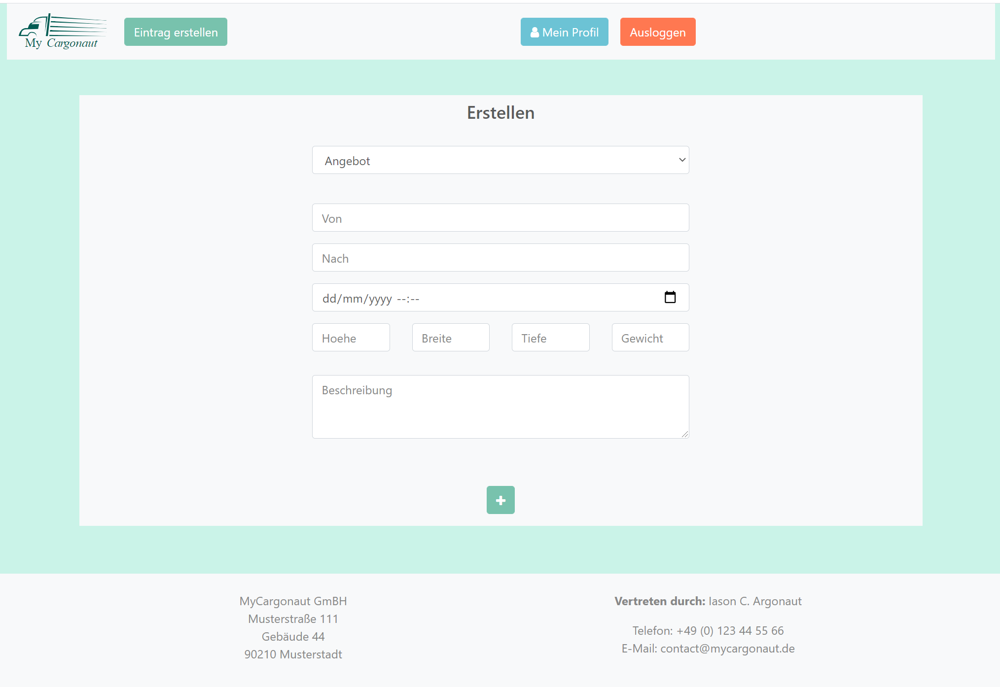
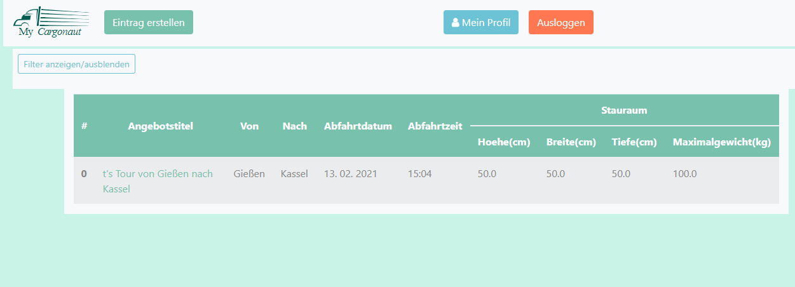
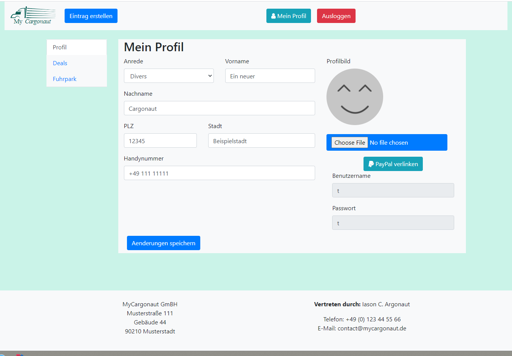
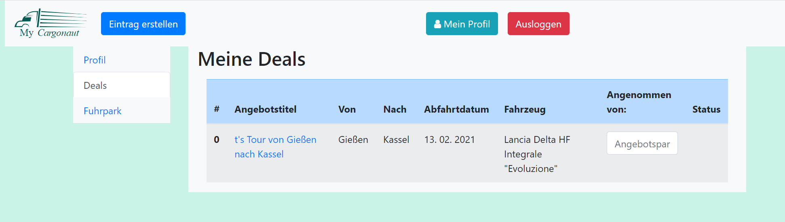
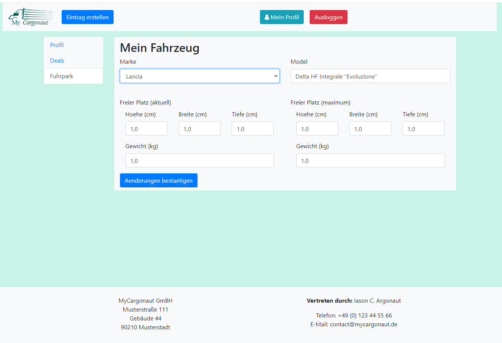

# MyCargonaut
MyCargonaut is a community driven web app solution to private cargo delivering. In short, MyCargonaut aims to be a
platform where users can offer to drive other user's cargo from point A to point B. Any monetary transactions will be
handled between users; MyCargonaut will not take a cent in cuts.

MyCargonaut was created in tandem with the THM computer science lecture KMS as the big programming project of the 
semester.

## Technologies

MyCargonaut uses a platera of different technologies to get the job done:

The whole backend is build on an union of `ES6 JavaScript` and `openjdk15 Java`, enabled via `Javalin 3.13`.

The front end is basic `HTML5` on a custom `Bootstrap 5.0.0` stylesheet as well as a few manual 
`CSS3` additions. MyCargonaut uses server-sided rendering via a relatively new template engine for Java: 
[JTE](https://github.com/casid/jte)

Regarding code maintenance we are using `JUnit5` as well as `npm 7.5.2` for general testing, as well as tools like 
`TravisCI` and `HoundCI` for continuous deployment & delivery on GitHub.

## Prerequisites

###Host
For best results, the host machine requires a modern UNIX operating system. You will need `gradle 6.7.1` or compatible 
version, as well as `openjdk15` or higher.

###Client
The client will only require a connection to the host system and any modern web browser.

## Install

## Feature Showcase

MyCargonaut is still WIP; it is more a technical demo created by two college students than a real business product.
It still offers some features you might want to see before downloading/using it.

The user interface is entirely in German and we have alot of dummy date still present, like the name of the company 
owner, company adress etc.

### Landing page

### Create offer

As of now we only support offers, not requests.

### Search offer

You enter the query at the landing page, which will redirect you to this site. It'll show you every entry that matches your
query.

### Profile w/ dummy data

Neither linking your Paypal nor uploading a new profile picture works right now. Those buttons are mere clickers.

### Deals

### Carpool

We managed to add persistency to MyCargonaut. Any accounts created, cars included to the car pools and especially 
entries added, will remain after shutting down the host server. 

## Contributing
Pull requests are welcome, but we don't plan on continuing the work on this project. The idea & icons of MyCargonaut 
came from the lecturers of the THM class "Konzepte moderner Softwareentwicklung" and are not our intellectual property.

## License
[MIT](https://choosealicense.com/licenses/mit/)